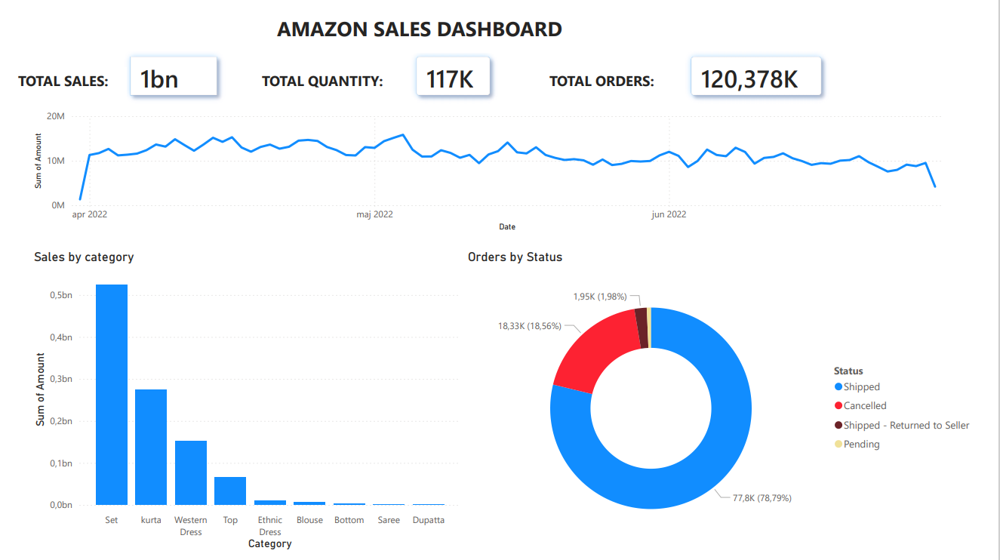

# Amazon Sales Dashboard - Power BI

This project presents an interactive Amazon Sales dashboard built in Power BI.

## Dashboard Features
- Total Sales KPI
- Total Quantity KPI
- Total Orders KPI
- Sales trend over time
- Sales by category
- Orders by status (Donut chart)

## Tools Used
- Power BI  
- Data visualization  
- Data modeling  

## Dataset
Amazon Sales dataset (CSV)

## Dashboard Preview

